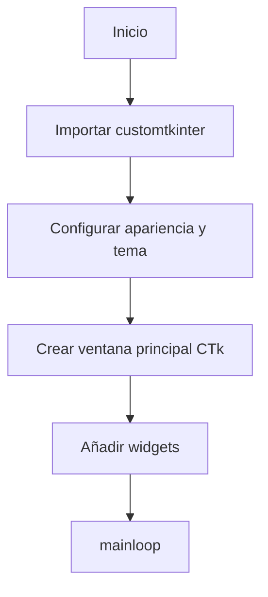
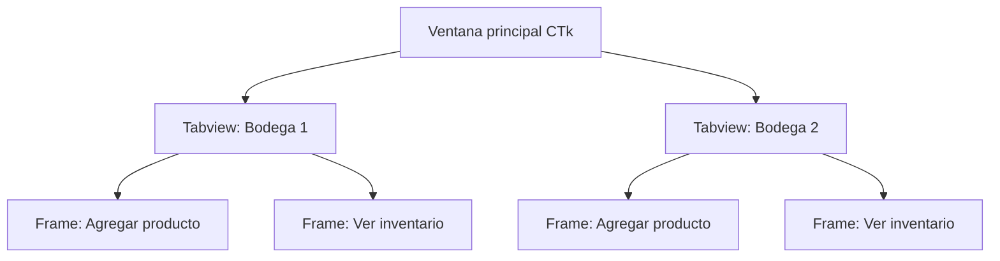

# Materia teórica y práctica: CustomTkinter (CTk) para gestión de inventario

---

## 1. ¿Qué es CustomTkinter (CTk)?
CustomTkinter es una librería moderna basada en Tkinter que permite crear interfaces gráficas (GUI) atractivas y personalizables en Python. Es ideal para proyectos como la gestión de inventario de bodegas, ya que facilita la creación de ventanas, botones, menús y tablas de manera sencilla y visualmente moderna.

---

## 2. Instalación de CustomTkinter
```bash
pip install customtkinter
```

---

## 3. Estructura básica de una app CTk


---

## 4. Componentes principales de CTk

### 4.1 Ventana principal (CTk)
La ventana principal es el punto de partida de toda aplicación CTk. Permite definir el tamaño, el título, el modo de apariencia (claro, oscuro o sistema) y el tema de color. Es el contenedor donde se agregan todos los demás widgets.

```python
import customtkinter as ctk
# Configuramos el modo de apariencia y el tema de color
ctk.set_appearance_mode("System")  # Opciones: system, light, dark
ctk.set_default_color_theme("blue")  # Temas: blue, dark-blue, green

# Creamos la ventana principal
app = ctk.CTk()
app.title("Mi App CTk")
app.geometry("400x250")  # Ancho x Alto en píxeles
app.mainloop()  # Inicia el bucle principal de la app
```
**Explicación:**
- `set_appearance_mode` permite que la app se adapte al modo del sistema o forzar claro/oscuro.
- `set_default_color_theme` define la paleta de colores.
- `CTk()` crea la ventana principal.
- `mainloop()` mantiene la ventana abierta y gestionando eventos.

**Ejemplo adicional:**
```python
app = ctk.CTk()
app.title("Inventario Bodega")
app.geometry("600x400")
app.mainloop()
```

---

### 4.2 Botón (CTkButton)
El botón es un widget interactivo que ejecuta una función cuando se presiona. Es fundamental para acciones como guardar, agregar, eliminar, etc.

```python
def accion():
    print("¡Botón presionado!")

boton = ctk.CTkButton(app, text="Presióname", command=accion)
boton.pack(pady=30)
```
**Explicación:**
- `text` define el texto que se muestra en el botón.
- `command` es la función que se ejecuta al presionar el botón.
- `.pack()` coloca el botón en la ventana.

**Ejemplo adicional:**
```python
def mostrar_mensaje():
    ctk.CTkLabel(app, text="¡Hola desde el botón!").pack()

boton2 = ctk.CTkButton(app, text="Mostrar mensaje", command=mostrar_mensaje)
boton2.pack(pady=10)
```

---

### 4.3 Etiqueta (CTkLabel)
Las etiquetas muestran texto en la interfaz. Son útiles para títulos, instrucciones, resultados, etc.

```python
etiqueta = ctk.CTkLabel(app, text="Texto de ejemplo")
etiqueta.pack(pady=10)
```
**Explicación:**
- `text` es el texto que se muestra.
- `.pack()` ubica la etiqueta en la ventana.

**Ejemplo adicional:**
```python
etiqueta_titulo = ctk.CTkLabel(app, text="Gestión de Inventario", font=("Arial", 18, "bold"))
etiqueta_titulo.pack(pady=20)
```

---

### 4.4 Entrada de texto (CTkEntry)
Permite al usuario ingresar datos. Se usa para nombres, cantidades, búsquedas, etc.

```python
entrada = ctk.CTkEntry(app, placeholder_text="Escribe tu nombre...")
entrada.pack(pady=20)
texto = entrada.get()  # Obtiene el texto ingresado
```
**Explicación:**
- `placeholder_text` muestra un texto guía cuando el campo está vacío.
- `.get()` recupera el valor ingresado.

**Ejemplo adicional:**
```python
def mostrar_nombre():
    nombre = entrada.get()
    ctk.CTkLabel(app, text=f"Hola, {nombre}!").pack()

entrada = ctk.CTkEntry(app, placeholder_text="Nombre")
entrada.pack(pady=10)
boton = ctk.CTkButton(app, text="Saludar", command=mostrar_nombre)
boton.pack()
```

---

### 4.5 Menú desplegable (CTkOptionMenu)
Permite seleccionar una opción de una lista. Ideal para elegir productos, bodegas, días, etc.

```python
opciones = ["Producto 1", "Producto 2", "Producto 3"]
menu = ctk.CTkOptionMenu(app, values=opciones)
menu.pack(pady=20)
seleccion = menu.get()  # Obtiene la opción seleccionada
```
**Explicación:**
- `values` define las opciones del menú.
- `.get()` devuelve la opción elegida.

**Ejemplo adicional:**
```python
def mostrar_producto():
    producto = menu.get()
    ctk.CTkLabel(app, text=f"Seleccionaste: {producto}").pack()

menu = ctk.CTkOptionMenu(app, values=["Manzana", "Pera", "Naranja"])
menu.pack(pady=10)
boton = ctk.CTkButton(app, text="Mostrar selección", command=mostrar_producto)
boton.pack()
```

---

### 4.6 Marco (CTkFrame)
Un marco es un contenedor para agrupar y organizar otros widgets. Facilita la estructura de la interfaz y la separación de secciones.

```python
frame = ctk.CTkFrame(app, corner_radius=10)
frame.pack(padx=20, pady=20, fill="both", expand=True)
```
**Explicación:**
- `corner_radius` redondea las esquinas del marco.
- `.pack()` lo ubica en la ventana.
- `fill` y `expand` permiten que el frame ocupe todo el espacio disponible.

**Ejemplo adicional:**
```python
frame = ctk.CTkFrame(app)
frame.pack(padx=10, pady=10)
ctk.CTkLabel(frame, text="Dentro del Frame").pack()
ctk.CTkButton(frame, text="Botón en Frame").pack()
```

---

### 4.7 Pestañas (CTkTabview)
Permite dividir la interfaz en secciones con pestañas, útil para separar funcionalidades (por ejemplo, diferentes bodegas o vistas).

```python
tabview = ctk.CTkTabview(app)
tabview.pack(fill="both", expand=True, padx=10, pady=10)
tabview.add("Bodega 1")
tabview.add("Bodega 2")
```
**Explicación:**
- `add("nombre")` crea una nueva pestaña.
- `.tab("nombre")` permite acceder a cada pestaña para agregar widgets.

**Ejemplo adicional:**
```python
tabview = ctk.CTkTabview(app)
tabview.pack(fill="both", expand=True)
tabview.add("Productos")
tabview.add("Inventario")
ctk.CTkLabel(tabview.tab("Productos"), text="Agregar productos").pack()
ctk.CTkLabel(tabview.tab("Inventario"), text="Ver inventario").pack()
```

---

### 4.8 Marco desplazable (CTkScrollableFrame)
Contenedor con barra de desplazamiento para mostrar listas largas o tablas. Es útil cuando hay muchos elementos y no caben en pantalla.

```python
scroll_frame = ctk.CTkScrollableFrame(app, width=300, height=200)
scroll_frame.pack(padx=20, pady=20, fill="both", expand=True)
```
**Explicación:**
- `CTkScrollableFrame` crea un frame con scroll vertical.
- Puedes agregar cualquier widget dentro del scroll_frame.

**Ejemplo adicional:**
```python
scroll_frame = ctk.CTkScrollableFrame(app, width=300, height=200)
scroll_frame.pack(padx=10, pady=10)
for i in range(15):
    ctk.CTkLabel(scroll_frame, text=f"Producto {i+1}").pack(pady=2)
```

---

### 4.9 Simulación de tabla con CTkFrame y CTkLabel
CTk no tiene un widget de tabla nativo, pero se puede simular usando CTkFrame y CTkLabel en una cuadrícula. Para organizar los widgets en filas y columnas se usan los métodos `.grid()` y `.pack()`.

```python
frame = ctk.CTkFrame(app)
frame.pack(padx=20, pady=20, fill="both", expand=True)
headers = ["Producto", "Lunes", "Martes", "Miércoles"]
for col, head in enumerate(headers):
    ctk.CTkLabel(frame, text=head, font=("Arial",12,"bold"), fg_color=("gray75","gray30"), text_color="white", corner_radius=5, width=100, height=30).grid(row=0, column=col, padx=5, pady=5)
filas = [["Manzanas", 10, 12, 8], ["Peras", 7, 9, 11], ["Plátanos", 5, 6, 7]]
for r_idx, fila in enumerate(filas, start=1):
    for c_idx, val in enumerate(fila):
        ctk.CTkLabel(frame, text=str(val), font=("Arial",12), width=100, height=30, corner_radius=5, fg_color=("white","gray20") if r_idx%2==0 else ("gray90","gray10")).grid(row=r_idx, column=c_idx, padx=5, pady=5)
```
**Explicación:**
- `.grid(row, column)` permite ubicar widgets en una cuadrícula (filas y columnas).
- `.pack()` ubica widgets uno debajo del otro o al costado, pero no permite cuadrículas.

**Diferencias entre .grid() y .pack():**
- `.pack()` es más simple, ideal para layouts verticales u horizontales sencillos.
- `.grid()` es mejor para organizar widgets en tablas o estructuras complejas.
- No se deben mezclar en el mismo contenedor (frame).

**¿Cuándo usar cada uno?**
- Usa `.pack()` para apilar widgets (botones, etiquetas) de forma simple.
- Usa `.grid()` para tablas, formularios o cuando necesitas filas y columnas.

**Ejemplo con .pack():**
```python
ctk.CTkLabel(app, text="Etiqueta arriba").pack()
ctk.CTkButton(app, text="Botón abajo").pack()
```

**Ejemplo con .grid():**
```python
for i in range(3):
    for j in range(3):
        ctk.CTkLabel(frame, text=f"{i},{j}").grid(row=i, column=j)
```

---

### 4.10 Tabla avanzada con TK.Treeview
Aunque CustomTkinter no incluye un widget de tabla nativo, es posible integrar el widget Treeview de Tkinter para mostrar datos tabulares de forma avanzada. Treeview permite crear tablas con múltiples columnas, encabezados y selección de filas, ideal para mostrar inventarios o reportes.

```python
import tkinter as tk
from tkinter import ttk
frame_tk = tk.Frame(master=app)
frame_tk.pack(padx=20, pady=20, fill="both", expand=True)
columnas = ("Producto", "Cantidad")
tree = ttk.Treeview(frame_tk, columns=columnas, show="headings")
tree.heading("Producto", text="Producto")
tree.heading("Cantidad", text="Cantidad")
tree.insert("", tk.END, values=("Manzanas", 10))
tree.pack(fill="both", expand=True)
```
**Explicación:**
- Se crea un frame de Tkinter dentro de la ventana CTk.
- El Treeview se coloca dentro de ese frame.
- Se pueden agregar columnas, encabezados y filas dinámicamente.
- Permite scroll, selección y edición de filas.

**Ejemplo adicional:**
```python
productos = [("Manzanas", 10), ("Naranjas", 5), ("Peras", 8)]
for producto, cantidad in productos:
    tree.insert("", tk.END, values=(producto, cantidad))
```

---

## 5. Ejemplo de aplicación de inventario (estructura general)


---

## 6. Consejos para el desarrollo
- Usa `.pack()`, `.grid()` o `.place()` para ubicar los widgets.
- Personaliza colores y estilos para mejorar la experiencia.
- Organiza el código en funciones para mayor claridad.
- Comenta tu código para explicar la lógica de cada parte.
- Prueba cada componente por separado antes de integrarlos.

---

## 7. Recursos adicionales
- [Documentación oficial de CustomTkinter](https://customtkinter.tomschimansky.com/documentation)
- [Ejemplos en la carpeta de Materiales/Ejemplos](../Ejemplos)
- [Ejercicios prácticos en la carpeta de Materiales/Ejercicios](../Ejercicios)

---

## 8. ¡A practicar!
Ahora que conoces los componentes y su uso, revisa los ejemplos y resuelve los ejercicios propuestos para dominar CustomTkinter en la gestión de inventario.
